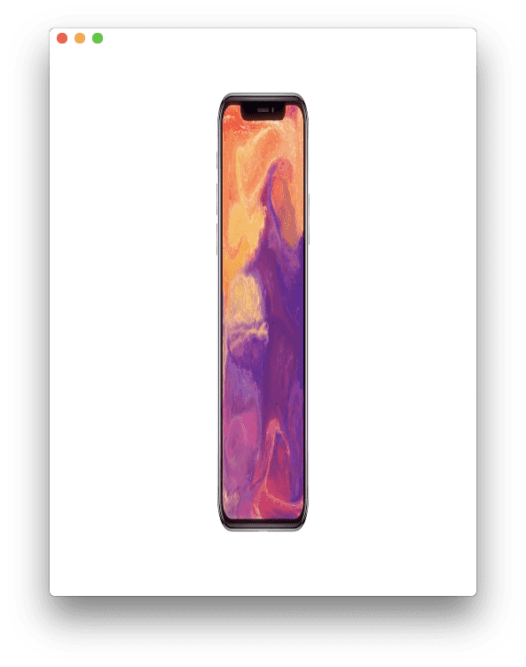
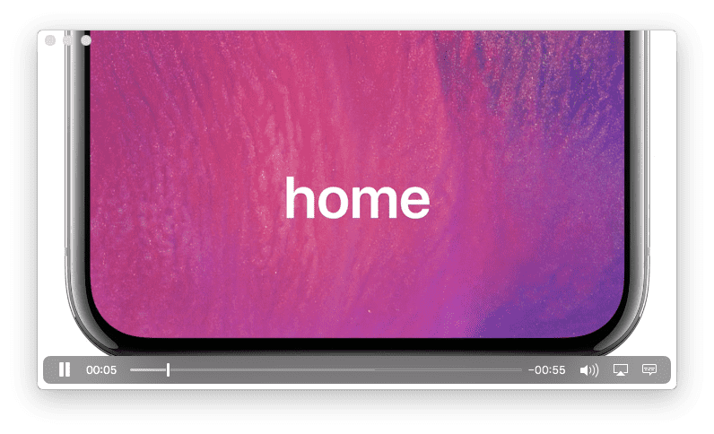

# Player

[](https://travis-ci.org/piemonte/Player)
[](http://cocoadocs.org/docsets/Player) 
[](http://cocoadocs.org/docsets/Player/) 
[](https://github.com/Carthage/Carthage)
[](https://developer.apple.com/swift) 
[](https://github.com/piemonte/Player/blob/master/LICENSE)


<p align="center"><b>Player is a simple cross-platform video player library written in Swift.</b>
<br>
<br>
⚠️ <b>Warning</b>: version 0.9 has breaking API changes. ⚠️</p>

### Looking for...
- An obj-c video player? Check out [PBJVideoPlayer (obj-c)](https://github.com/piemonte/PBJVideoPlayer).
- A Swift camera library? Check out [Next Level](https://github.com/NextLevel/NextLevel).

### Features
- [x] plays local media or streams remote media over HTTP
- [x] customizable UI and user interaction
- [x] no size restrictions
- [x] orientation change support
- [x] simple API

### Future Features
- [ ] use `AVPlayerViewController` for iOS/tvOS platforms

## Installation
`Player` is available for installation using the Cocoa dependency manager CocoaPods & Carthage.  Alternatively, you can simply copy the `Player.swift` file into your Xcode project.

### Using [CocoaPods](http://cocoapods.org/)

```ruby
pod "Player"
```

Need Swift 3? Use release `0.7.0`

```ruby
pod "Player", "~> 0.7.0"
```

### Using [Carthage](https://github.com/Carthage/Carthage)

```ruby
github "piemonte/Player"
```

## Quick Start

The sample projects provide an example of how to integrate `Player`, otherwise you can follow these steps.

Create and add the `Player` to your view controller.

```swift
 let player = Player()
 player.playerDelegate = self
 player.playbackDelegate = self
 player.view.frame = view.bounds
 player.add(to: self)
```

Provide the file path to the resource you would like to play locally or stream. Ensure you're including the file extension.

```swift
let videoUrl: URL = // file or http url
player.url = videoUrl
```

play/pause/chill

```swift
player.playFromBeginning()
```

Adjust the fill mode for the video, if needed.

```swift
 player.fillMode = .resizeAspectFit
```

The fill mode can be set to the following values:

`.resizeAspectFit` (default)


`.resizeAspectFill`


`.resizeStretch` (aka please don't. I mean look at the poor thing)


Display video playback progress, if desired. Note, all delegate methods are optional.

```swift
extension ViewController: PlayerPlaybackDelegate {

	public func playerPlaybackWillStartFromBeginning(player: Player) {}
    
    public func playerPlaybackDidEnd(player: Player) {}
    
    public func playerCurrentTimeDidChange(player: Player) {
        let currentProgress = Float(player.currentTime / player.maximumDuration)
        progressView.setProgress(currentProgress, animated: true)
    }
    
    public func playerPlaybackWillLoop(player: Player) {
        progressView.setProgress(0.0, animated: false)
    }
    
}
```

### macOS
On the macOS platform, the player can display media controls. 

```swift
player.controlsStyle = .floating
```

The controls' style can be set to the following:

`.none`

`.inline` (default)


`.minimal`


`.floating`


## Documentation

You can find [the docs here](http://piemonte.github.io/Player/). Documentation is generated with [jazzy](https://github.com/realm/jazzy) and hosted on [GitHub-Pages](https://pages.github.com).

## Community

- Need help? Use [Stack Overflow](http://stackoverflow.com/questions/tagged/player-swift) with the tag 'player-swift'.
- Questions? Use [Stack Overflow](http://stackoverflow.com/questions/tagged/player-swift) with the tag 'player-swift'.
- Found a bug? Open an [issue](https://github.com/piemonte/player/issues).
- Feature idea? ~~Open an [issue](https://github.com/piemonte/player/issues).~~ Do it yourself & PR when done 😅.
- Want to contribute? Submit a [pull request](https://github.com/piemonte/player/pulls).

## Used In

- [Cards](https://github.com/PaoloCuscela/Cards) — Awesome iOS 11 appstore cards written in swift 4.

## Resources

* [Swift Evolution](https://github.com/apple/swift-evolution)
* [AV Foundation Programming Guide](https://developer.apple.com/library/ios/documentation/AudioVideo/Conceptual/AVFoundationPG/Articles/00_Introduction.html)
* [Next Level](https://github.com/NextLevel/NextLevel/), rad media capture in Swift
* [PBJVision](https://github.com/piemonte/PBJVision), iOS camera engine, features touch-to-record video, slow motion video, and photo capture
* [PBJVideoPlayer](https://github.com/piemonte/PBJVideoPlayer), a simple iOS video player library, written in obj-c

## License

Player is available under the MIT license, see the [LICENSE](https://github.com/piemonte/player/blob/master/LICENSE) file for more information.

